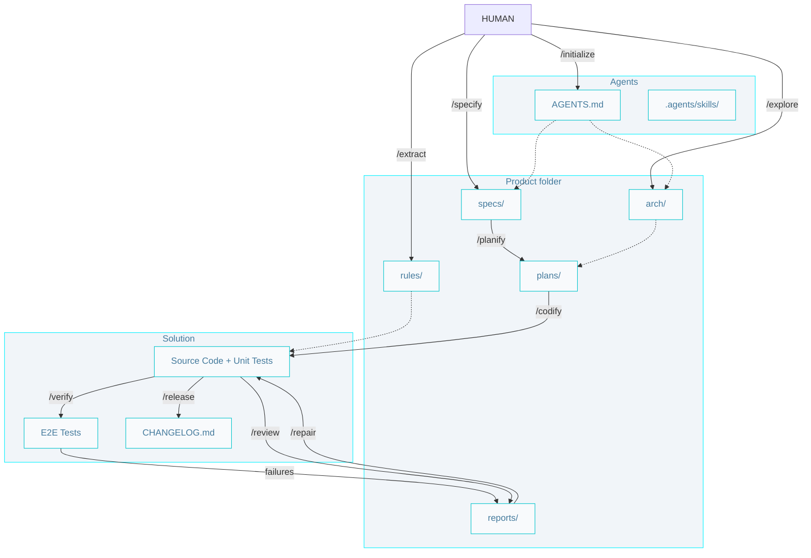
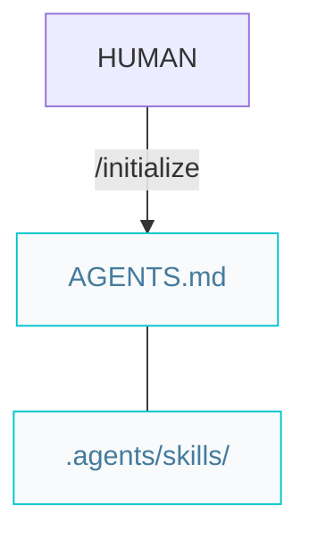
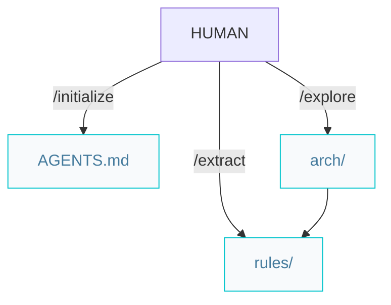
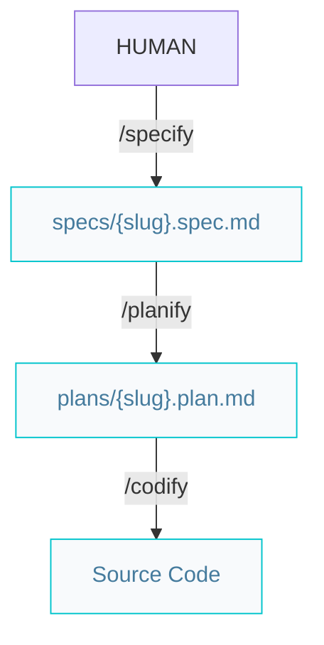
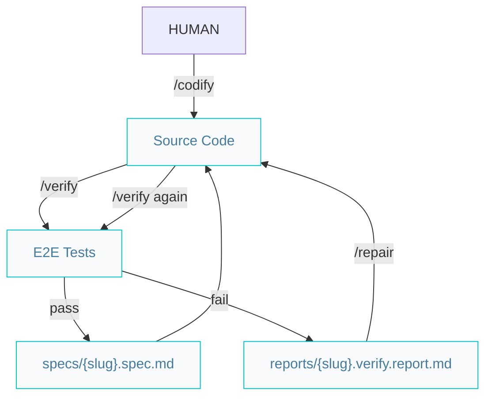
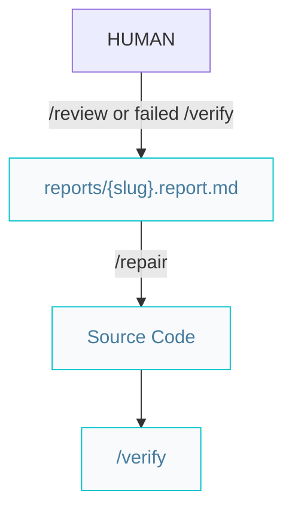

AIDDbot implements **AI-Driven Development (AIDD)** — AI acceleration with software engineering practices that professional teams already trust.

## The AIDD philosophy

Three principles guide every skill and every artifact:

### Spec-driven development

Define the problem precisely before any code is written. Specifications include formal acceptance criteria so agents, engineers, and stakeholders share the same definition of done.

### Rules over tools

Skills, `AGENTS.md`, and conventions you define travel with the repo across IDEs and agents. No vendor lock-in — your rules outlive any single tool.

### Human in the loop

You are the decision-maker. Approve specs, plans, code, and tests. You own what merges.

## End-to-end workflow

## Architect pipeline

Set up project context before building features.

### Greenfield

### Brownfield

When complete, start features with `/specify`.

## Builder pipeline

Every new feature follows this order:

- `/planify` is recommended for non-trivial work.
- `/codify` creates a `feat/{slug}` branch before writing code.
- Unit tests are produced as part of `/codify`, not as a separate step.

## Verify and repair loop

End-to-end tests confirm specs are actually met — not just that code compiles.

On failure, `/verify` writes a report under `.product/reports/`. Run `/repair` on that report, then re-run `/verify`. The spec stays `in-progress` until tests pass.

## Craftsman pipeline

After building, improve and ship with confidence.

### Review and repair

Use `/repair` for findings from `/review` or `/verify`. Review repairs preserve behavior unless fixing a defect; verify repairs may change behavior to meet acceptance criteria.

### Release

Requires specs at `status: verified`. Merge `feat/{slug}` to the default branch, then run `/release` to bump semver, update `CHANGELOG.md`, and mark specs as released.

## Human checkpoints

| Step | You review |
| --- | --- |
| `/specify` | Problem, solution, and acceptance criteria |
| `/planify` | Implementation order and scope |
| `/codify` | Code and unit tests before merge |
| `/verify` | E2E results and failure reports |
| `/review` | Quality feedback before acting |
| `/release` | Version bump and changelog |

**Next:** [Skills catalog](/skills/) · [Getting started](/getting-started/)
