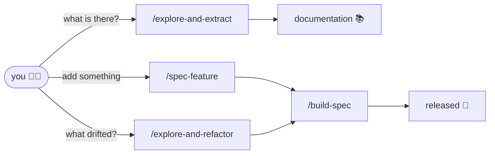
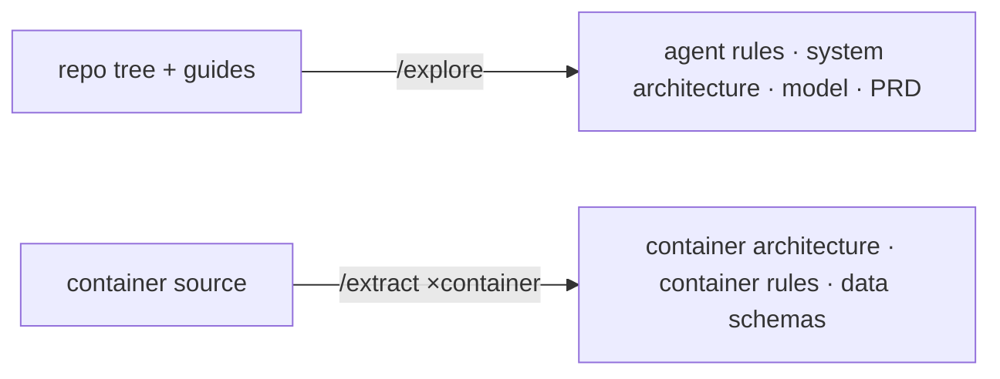
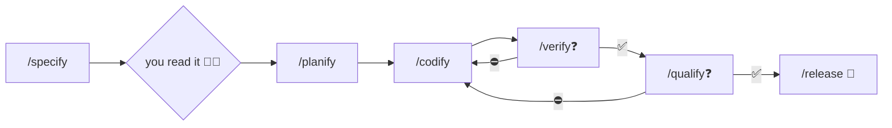
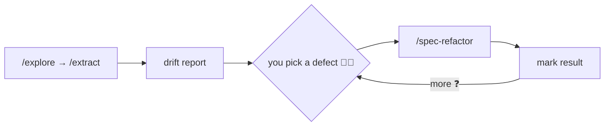

AIDDbot implements **AI-Driven Development** — agent acceleration with practices professional teams already trust. The full picture lives in the [repo docs](https://github.com/AIDDbot/AIDDbot/blob/main/docs/AIDD.workflow.md); this page is the short version.

## What holds it together

**The green e2e suite is the contract.** A green test changes only through a plan, which makes a silent behavior change structurally impossible.

**One writer, two evaluators.** `/codify` is the only skill that writes code. `/verify` and `/qualify` only judge and report. Nothing grades its own work.

**Every cycle starts from a spec.** What differs is which door it came through.

## The three doors



Documentation first: the other doors read it. Feature and refactor both converge on the same build machine.

## Understanding what is there

```markdown
/explore-and-extract
```



- **`/explore`** sees the repo tree and Guide files only — produces the system-level view.
- **`/extract`** reads source, one container at a time — produces that container's detail.

Both apply **evidence wins**: describe what exists, propose a default where nothing does.

## Building a feature

```markdown
/spec-feature riders can rate a trip 1 to 5 stars
```



1. **`/specify`** writes the spec — problem, outcomes, numbered acceptance criteria.
2. **You read it** — the one manual checkpoint.
3. Loops close on red tests or failed gates via `/codify`. Nothing ships until both are green.

## Re-exploring for drift

```markdown
/explore-and-refactor
```



Same documentation pass as explore, plus a comparison against what those docs expect. `/spec-refactor` runs the same build machine underneath — with **suite non-regression** as the first criterion.

## Two kinds of spec

Both are written by `/specify`; the command (or you) names the kind.

| | Functional | Refactor |
| --- | --- | --- |
| From | a requirement | a structural directive |
| Branch | `feat/{spec_key}` | `refactor/{spec_key}` |
| Judged by | `/verify` + e2e suite | `/qualify` gates + `/verify` non-regression |

Status chain: `pending` → `planned` → `in-progress` → `verified` | `failed` → `done`.

**Next:** [Getting started](/getting-started/) · [Skills catalog](/skills/) · [GitHub](https://github.com/AIDDbot/AIDDbot)
