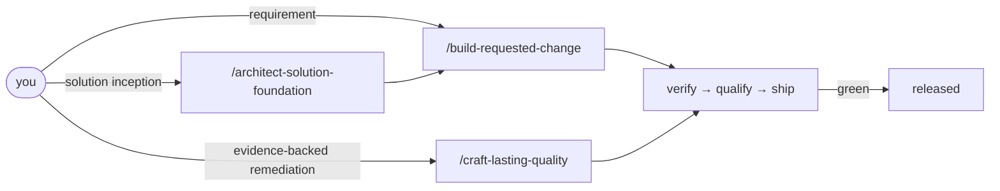

AIDDbot implements **AI-Driven Development** — agent speed with practices professional teams already trust. This page is the short version; the full picture lives in the [repo workflow docs](https://github.com/AIDDbot/AIDDbot/blob/main/docs/AIDD.workflow.md).

## What holds

**The green e2e suite is the contract.** Behavior changes only through a planned path — silent drift is structurally hard.

**One delivery writer, two evaluators.** `/codify` writes delivery code. `/verify` and `/qualify` only judge and report. Nothing grades its own work.

**Requested changes start from a specification.** Maintenance starts from accepted findings. Craftsman ships only after verification and qualification are green.

## Three entrypoints

You invoke a public **orchestrator**. The session follows linked skills and spawns Architect, Builder, or Craftsman where required.

| Role | Orchestrator | Job |
| --- | --- | --- |
| **A · Architect** | `/architect-solution-foundation` | Map an existing solution or design a greenfield one |
| **B · Builder** | `/build-requested-change` | Scope, specify, implement, verify, qualify, and ship |
| **C · Craftsman** | `/craft-lasting-quality` | Turn durable quality findings into a safe remediation |



These three orchestrators are the stable public starting points. Focused skills remain available as an advanced interface — see the [skills catalog](/skills/) or the [full catalog on GitHub](https://github.com/AIDDbot/AIDDbot/blob/main/.agents/skills/skills.catalog.md).

## Requirement delivery

```markdown
/build-requested-change riders can rate a trip 1 to 5 stars
```

Architect scopes every requirement: one specification or several coordinated ones. You validate problem, outcomes, and acceptance criteria when the workflow stops (unless you include YOLO).

Then Builder plans and codes. Craftsman verifies, qualifies, and ships. Functional or quality defects are fixed and review restarts until both gates are green.

One-spec work and multi-spec changes both converge on the same review path — one verify, one qualify, one release for the complete scope.

## Solution improvement

```markdown
/craft-lasting-quality
```

Craft consolidates verification, qualification, and quality evidence into durable findings. You approve the remediation scope. Accepted behavior-preserving fixes ship as a green patch — without inventing a new product requirement.

A finding that needs changed observable behavior stays pending; that belongs to `/build-requested-change`.

Status chain: `pending` → `planned` → `in-progress` → `verified` → `qualified` → `released`.

**Next:** [Getting started](/getting-started/) · [Skills catalog](/skills/) · [GitHub](https://github.com/AIDDbot/AIDDbot)
