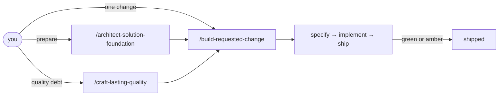

AIDDbot implements **AI-Driven Development** — agent speed with practices professional teams already trust. This page is the short version; the full picture lives in the [repo workflow docs](https://github.com/AIDDbot/AIDDbot/blob/main/docs/AIDD.workflow.md).

## What holds

**One change, one specification.** Requirement text lives in the PRD. A spec marks what is new, changed, deprecated, or related, and declares its acceptance tests. Spec state: `draft` → `in-progress` → `verified` → `qualified` → `shipped`.

**Evidence, not self-grading.** Verification must be `green` to ship. Qualification may be `green` or `amber`; `red` blocks. Amber findings become technical debt. A third unresolved red report stops for a human.

**Quality review is a deeper pass.** Everyday delivery runs basic lint, unit tests, acceptance tests, and a review of the changed code. System-wide lint, complexity, coverage, and related checks belong to `/craft-lasting-quality`.

## Three entrypoints

You invoke a public **orchestrator**. The session follows linked skills and assigns Architect, Builder, or Craftsman where required.

| Need | Orchestrator |
| --- | --- |
| Prepare or understand a solution | `/architect-solution-foundation` |
| Deliver one change | `/build-requested-change` |
| Review quality and repair debt | `/craft-lasting-quality` |


```mermaid
flowchart LR
  YOU([you]) -->|prepare| FOUND["/architect-solution-foundation"]
  YOU -->|one change| DELIVER["/build-requested-change"]
  YOU -->|quality debt| QUALITY["/craft-lasting-quality"]
  FOUND --> DELIVER
  QUALITY --> DELIVER
  DELIVER --> LOOP["specify → implement → ship"]
  LOOP -->|green or amber| SHIPPED[shipped]
```

These three orchestrators are the stable public starting points. Focused skills remain available as an advanced interface — see the [skills catalog](/skills/) or the [full catalog on GitHub](https://github.com/AIDDbot/AIDDbot/blob/main/.agents/skills/skills.catalog.md).

## Foundation

| Repository | Result |
| --- | --- |
| No application source | Scaffold, dependencies, documentation, rules, and product records |
| Existing application source | Documentation, rules, and missing product records |

Existing product records are preserved. Scaffolding does not invent functional product code.

## Change delivery

```markdown
/build-requested-change riders can rate a trip from 1 to 5 stars
```

| Stage | Owner | Work |
| --- | --- | --- |
| Define | **Architect** | One spec, PRD proposal, branch, and approval |
| Build | **Builder** | Code and the tests that spec requires |
| Prove and ship | **Craftsman** | Verify acceptance, qualify changed code, release |

You approve the spec unless you include YOLO. After that, delivery implements, proves, and ships without another slash command. Functional or quality `red` reports route back to implementation until both gates pass — or until the revisions ceiling asks you to take over.

Shipping applies the PRD changes, updates debt and changelog records, and integrates the branch.

## Quality review

```markdown
/craft-lasting-quality
```

Craftsman curates system-wide evidence and refreshes `quality/TDR.md`. Architect then selects one coherent group of debt. That group becomes a natural-language repair request and enters `/build-requested-change` — the same specify → implement → ship loop.

If no eligible debt remains, you get the quality review and nothing else is invented.

**Next:** [Getting started](/getting-started/) · [Skills catalog](/skills/) · [GitHub](https://github.com/AIDDbot/AIDDbot)
