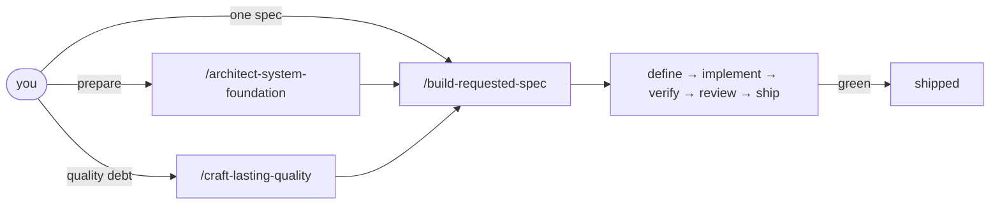

AIDDbot implements **AI-Driven Development** — agent speed with practices professional teams already trust. This page is the short version; the full picture lives in the [repo workflow docs](https://github.com/AIDDbot/AIDDbot/blob/main/docs/AIDD.workflow.md).

## What holds

**One change, one specification.** The spec owns its requirements. The PRD is the product view of what already shipped — generated, not handwritten.

**Acceptance is the gate.** Builder writes and checks. Craftsman records the evidence. Green ships. Red goes back for repair. After three rounds, leftovers ship only as recorded debt.

**Review does not block.** An expert pass catches what linters miss. Those findings become debt and stay visible.

**Docs that follow the code.** Shipping updates the product model and promotes lessons into the project rules.

## Three entrypoints

| Need | Orchestrator |
| --- | --- |
| Prepare or understand a system | `/architect-system-foundation` |
| Deliver one spec | `/build-requested-spec` |
| Review quality and repair debt | `/craft-lasting-quality` |


```mermaid
flowchart LR
  YOU([you]) -->|prepare| FOUND["/architect-system-foundation"]
  YOU -->|one spec| DELIVER["/build-requested-spec"]
  YOU -->|quality debt| QUALITY["/craft-lasting-quality"]
  FOUND --> DELIVER
  QUALITY --> DELIVER
  DELIVER --> LOOP["define → implement → verify → review → ship"]
  LOOP -->|green| SHIPPED[shipped]
```

These three orchestrators are the public starting points. Focused skills stay available — see the [skills catalog](/skills/).

## Foundation

Empty repo: Architect proposes the system, you approve, then it scaffolds and documents. Existing app: it documents what is there. Product records already in the repo are kept.

Run it again whenever documentation should match the code.

## Change delivery

```markdown
/build-requested-spec riders can rate a trip from 1 to 5 stars
```

| Stage | Owner | Work |
| --- | --- | --- |
| Define | **Architect** | One spec that owns its requirements. You approve it — unless you include YOLO. |
| Build | **Builder** | Code and tests, including a check of this spec's acceptance. |
| Prove and ship | **Craftsman** | Records acceptance, reviews the diff, releases. |

A red acceptance report goes back to Builder. After three rounds, remaining failures are recorded as debt — never hidden. Review findings become debt on the way out; they do not stop the release.

## Quality review

```markdown
/craft-lasting-quality
```

Scan the system, pick one coherent slice of debt, and deliver it through `/build-requested-spec`. If nothing eligible remains, you get the debt summary and the loop stops.

**Next:** [Getting started](/getting-started/) · [Skills catalog](/skills/) · [GitHub](https://github.com/AIDDbot/AIDDbot)
