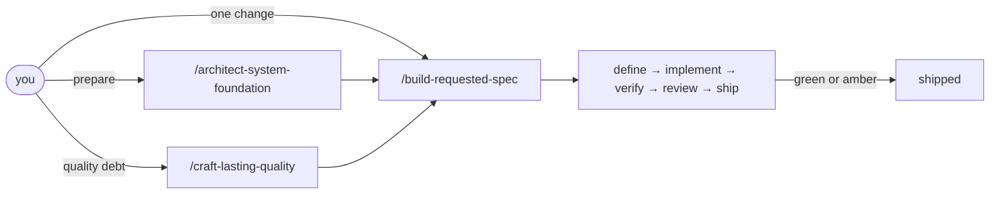

AIDDbot implements **AI-Driven Development** — agent speed with practices professional teams already trust. This page is the short version; the full picture lives in the [repo workflow docs](https://github.com/AIDDbot/AIDDbot/blob/main/docs/AIDD.workflow.md).

## What holds

**One change, one specification.** Requirement text lives in the PRD. A spec marks what is new, changed, deprecated, or related, declares its schema impact, and lists its acceptance tests. Spec state: `draft` → `in-progress` → `verified` → `qualified` → `shipped`.

**Evidence, not self-grading.** Verification must be `green`. The changed-code review may be `green` or `amber`; `red` goes back for repair. Amber findings become technical debt. After three repair rounds, anything still red ships only as recorded debt — never hidden.

**Docs that follow the code.** Product schemas live in `model/`. Undeclared shape changes are blocked at review, and shipping reconciles the schemas and promotes lessons learned into the project rules.

**Quality review is a deeper pass.** Everyday delivery runs error-level lint, unit tests, acceptance tests, and a review of the changed code. Warning denial, complexity, coverage, and other system-wide checks belong to `/craft-lasting-quality`.

## Three entrypoints

You invoke a public **orchestrator**. It follows linked skills and assigns Architect, Builder, or Craftsman where required, each at the effort level the task deserves.

| Need | Orchestrator |
| --- | --- |
| Prepare or understand a system | `/architect-system-foundation` |
| Deliver one spec | `/build-requested-spec` |
| Review quality and repair debt | `/craft-lasting-quality` |


```mermaid
flowchart LR
  YOU([you]) -->|prepare| FOUND["/architect-system-foundation"]
  YOU -->|one change| DELIVER["/build-requested-spec"]
  YOU -->|quality debt| QUALITY["/craft-lasting-quality"]
  FOUND --> DELIVER
  QUALITY --> DELIVER
  DELIVER --> LOOP["define → implement → verify → review → ship"]
  LOOP -->|green or amber| SHIPPED[shipped]
```

These three orchestrators are the stable public starting points. Focused skills remain available as an advanced interface — see the [skills catalog](/skills/) or the [full catalog on GitHub](https://github.com/AIDDbot/AIDDbot/blob/main/.agents/skills/skills.catalog.md).

## Foundation

| Repository | Result |
| --- | --- |
| No application source | Scaffold, dependencies, root run scripts, documentation, rules, and product records |
| Existing application source | Documentation, schemas, rules, and missing product records |

Existing product records are preserved. Scaffolding does not invent functional product code.

Run it again at any time to resync the documentation with the code: structure and schemas are rewritten from source, while the rules learned at shipping are kept.

## Change delivery

```markdown
/build-requested-spec riders can rate a trip from 1 to 5 stars
```

| Stage | Owner | Work |
| --- | --- | --- |
| Define | **Architect** | One spec, PRD proposal, schema impact, branch, and approval |
| Build | **Builder** | Code, unit tests, and acceptance-test changes per project |
| Prove and ship | **Craftsman** | Run acceptance tests, review changed code, release |

You approve the spec unless you include YOLO. After that, delivery implements, proves, and ships without another slash command. A `red` report routes back to implementation and restarts at verification — up to three rounds, after which the remaining failures are recorded as debt.

Shipping applies the PRD and schema changes, updates debt, promotes lessons into the project rules, syncs one release version across changelog, tag, and manifests, and integrates the branch.

## Quality review

```markdown
/craft-lasting-quality
```

Craftsman inspects system-wide evidence and refreshes `quality/TDR.md`. Architect then selects one coherent group of debt. That group becomes a repair request and enters `/build-requested-spec` — the same define → implement → ship loop.

If no eligible debt remains, you get the quality review and nothing else is invented.

**Next:** [Getting started](/getting-started/) · [Skills catalog](/skills/) · [GitHub](https://github.com/AIDDbot/AIDDbot)
