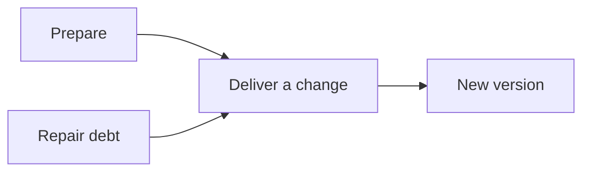

You start one command. AIDDbot writes a spec, builds the change, checks it, and ships a version. This page is that loop. The rules in full are in the repository: [How it works](https://github.com/AIDDbot/AIDDbot/blob/main/docs/how-it-works.md) and the [AIDD workflow](https://github.com/AIDDbot/AIDDbot/blob/main/docs/AIDD.workflow.md).

## The idea

Each change starts as a small spec. You approve it before the code starts. Each requirement has a test. The change ships when those tests pass. If something still fails, it is recorded as debt.

The models design, write, and review. A small program runs the tests and keeps the evidence.

## Three commands

| Need | Command |
| --- | --- |
| Start a new system, or document an existing one | `/architect-system-foundation` |
| Deliver one change | `/build-requested-spec your request` |
| Repair technical debt | `/craft-lasting-quality` |

In Codex, use `$` instead of `/`.

```mermaid
flowchart LR
  A[Prepare] --> B[Deliver a change]
  C[Repair debt] --> B
  B --> V[New version]
```

## Three agents

| Agent | Work |
| --- | --- |
| **Architect** | Writes the spec and chooses what to repair |
| **Builder** | Writes the code and the tests |
| **Craftsman** | Runs the tests, reviews the code, and ships |

A different agent checks the work. The Craftsman is never the Builder.

## One change

1. You describe the change in plain language.
2. The Architect writes one spec and waits for you. Add `YOLO` to skip that pause.
3. The Builder writes the code and the tests.
4. The Craftsman runs the tests, reviews the change, and ships a version.

**Next:** [Getting started](/getting-started/) · [How it works](https://github.com/AIDDbot/AIDDbot/blob/main/docs/how-it-works.md) · [GitHub](https://github.com/AIDDbot/AIDDbot)
